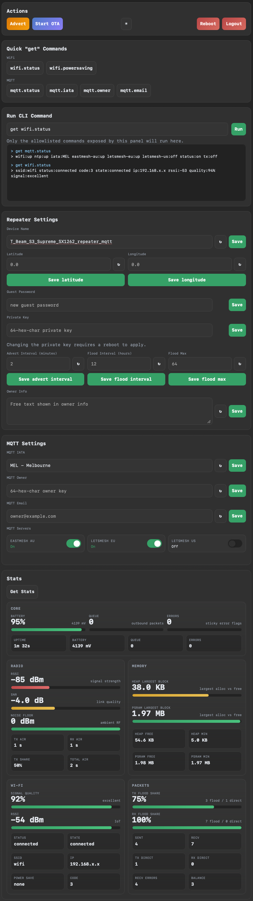

# Repeater Web Panel

This page is for end users running an EastMesh `*_repeater_mqtt` build with the local web panel enabled.

It covers how to reach the panel, what each section does, and what to expect when using it on desktop or mobile.

## What It Is

The repeater web panel is a local HTTPS configuration page served directly by the repeater over WiFi.

It gives you:

- a password-gated local admin page
- quick `get` commands for common repeater and MQTT checks
- a terminal-style CLI panel for allowlisted commands
- editable repeater settings
- editable MQTT settings
- a stats dashboard with Wi-Fi, core, radio, memory, and packet views

Operational guidance:

- use it for initial setup, occasional configuration changes, and troubleshooting
- when you are finished, prefer `set web off` on MQTT repeaters that need maximum headroom
- this leaves more internal heap available for MQTT/WSS activity, especially on dual-broker setups

## Screenshot Overview

The layout below reflects the current panel structure for the repeater web UI.

## Requirements

You need:

- a supported `*_repeater_mqtt` firmware build
- WiFi configured on the repeater
- the repeater connected to your local network
- the repeater admin password

Some constrained targets disable the web panel to stay within flash limits. If your board does not support it, `get web.status` will not show it as available.

## How To Open It

1. Connect the repeater to WiFi.
2. Find its IP address.
3. Open `https://<repeater-ip>/` in a browser.
4. Accept the browser warning for the self-signed certificate.
5. Enter the repeater admin password.

Useful CLI commands:

- `get wifi.status`: shows WiFi state and IP address when connected.
- `get web.status`: shows whether the web panel is up and which URL to use.

Example:

- `https://10.33.135.208/`

## Login And Security

- the panel uses the same admin password as the repeater CLI
- the connection is HTTPS, but the certificate is self-signed
- browsers will warn the first time you connect
- the panel only exposes an allowlisted subset of CLI commands

This is intended for local admin use on a trusted network, not for open internet exposure.

## Performance Notes

The panel is designed to load more gently than earlier versions. On login it now fetches sections in sequence instead of requesting one large bootstrap payload up front.

Even with that change, the panel still uses HTTPS and internal heap. On boards running one or two WSS MQTT brokers, opening the panel reduces MQTT headroom while the session is active.

Recommended practice for repeater deployments:

- enable the panel for initial configuration
- use it again for occasional checks or troubleshooting
- disable it with `set web off` when finished so MQTT has the most headroom available

## Actions

The Actions panel gives you the most common operational controls:

- `Advert`
- `Start OTA`
- `Reboot`
- `Logout`
- theme toggle

Use `Start OTA` only when you intend to update firmware.

## Quick "get" Commands

This section runs common read-only commands for:

- Wi-Fi
- MQTT

These are useful for quick checks without typing into the CLI field.

## Run CLI Command

This is a small terminal for allowlisted commands.

- press `Enter` to run the command
- command history is shown in the terminal box below
- save buttons elsewhere in the page also show the generated command and the reply here
- `clock` is available here if you want to check the repeater's current board time

This makes it easy to see exactly what the panel sent to the repeater.

## Repeater Settings

This section includes:

- Device Name
- Latitude
- Longitude
- Guest Password
- Private Key
- Advert Interval
- Flood Interval
- Flood Max
- Owner Info

Notes:

- `Latitude` and `Longitude` default to `0.0` as placeholders
- changing the private key requires a reboot to apply
- the refresh buttons load the current value from the repeater
- the save buttons send the matching CLI command immediately

## MQTT Settings

This section includes:

- `mqtt.iata`: selected from a curated east-coast/south-east list.
- `mqtt.owner`: owner public key.
- `mqtt.email`: owner contact email.
- MQTT server toggles: `eastmesh-au`, `letsmesh-eu`, and `letsmesh-us`.

`MEL` is used as the default dropdown option until the repeater's saved value is loaded.

Notes:

- the current MQTT server states are loaded when the page opens
- you can toggle each MQTT server on or off from this panel
- if all three servers are enabled at once, the panel shows a warning recommending two at most

## Stats

Press `Get Stats` to load the dashboard.

The stats page currently shows:

- Core
- Radio
- Memory
- Wi-Fi
- Packets

The dashboard is designed to work well on phones as well as desktop browsers.

## Mobile Use

The page is responsive and should work cleanly on a phone.

On mobile:

- quick command buttons collapse into a two-column layout
- action buttons stack more cleanly
- input rows stay usable for touch interaction
- stats cards reorganize into single-column sections where needed

## Common Tasks

### Check WiFi And MQTT

1. Open the panel.
2. Press `wifi.status` in Quick `get` Commands.
3. Press `mqtt.status` in Quick `get` Commands.
4. Press `Get Stats` for the dashboard view.

### Change Device Name

1. Edit `Device Name`.
2. Press `Save`.
3. Confirm the generated command and reply in the CLI terminal box.

### Update MQTT Owner Or Email

1. Go to `MQTT Settings`.
2. Enter the new value.
3. Press `Save`.
4. Use the refresh button if you want to re-read the stored value from the repeater.

### Start OTA

1. Press `Start OTA`.
2. Confirm the action.
3. Continue with your normal OTA workflow.

## Troubleshooting

### The browser warns about the certificate

That is expected. The panel uses a self-signed certificate generated for local use.

### I cannot reach the page

Check:

- the repeater is on WiFi
- the IP address from `get wifi.status`
- `get web.status` reports the panel as up
- your board/firmware target supports the web panel

### The panel opens but login fails

Use the repeater admin password, not the guest password.

### MQTT becomes unstable when I log in

The web panel now loads settings section-by-section to reduce startup pressure, but HTTPS still consumes internal heap.

Check:

- whether one or two MQTT brokers are enabled
- `memory` before and after login
- whether stability improves after `set web off`

For fixed installations where MQTT uptime matters more than browser access, use the panel briefly and then disable it again.

### A command says it is not allowlisted

The panel intentionally limits what can be run from the browser. Use the serial CLI for commands outside the web allowlist. `clock` is included, but most maintenance and debug commands are still serial-only.

### Stats or settings do not refresh

Try:

- refreshing the browser tab
- logging out and back in
- checking WiFi stability with `get wifi.status`

## Related Docs

- [Custom CLI Commands](./custom-cli.md)
- [Download and Flash Releases](./releases.md)
- [Build Locally With uv](./local-builds.md)
